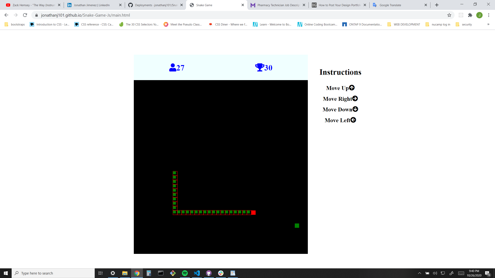

# Snake-Game-Js

The old classic Snake Game purely build with JavaScript, HTML Canvas and CSS

[Want to Play?](https://jonathanj101.github.io/Snake-Game-Js/main.html)

# Summary

I remember playing this old classic Snake Game on a Nokia 3310 back when i was a child (good times!). Furthermore, now that i got to test my skills and knowledge about programming with this application. Felt like i hit a wall. Those challenges that i faced were worth the while. Thus, sharpens my newly programing skills and understanding how HTML Canvas and JavaScript work together to give a "2d" animitation "motion".

# Author

**Jonathan Jimenez** - Full Stack Software Developer

- [LinkedIn](https://www.linkedin.com/in/jonathan-jimenez101/)
- [Codepen](https://codepen.io/jonathanj101/)
